# 🔍 Disk Forensics - Recovering Deleted Files from a Disk Image

### 📌 Project Overview
This project is aimed at conducting disk forensics with the purpose of restoring
deleted files on a disk image. A virtual machine (VMware) was used to create a
controlled environment and run Windows 10, in which sample files like images were
created and deleted.  
Forensic tools were then used to convert the virtual disk (.vmdk) to a
RAW (.dd) image and further converting it into an E01 forensic format. Analysis of the
disk image was done with Autopsy to restore deleted files. The project shows how
deleted data can be restored in case they are not overwritten and the significance of
forensic acquisition and analysis methods.

### 🖥️ Environment Setup
1. Host System
    - OS: Ubuntu
    - Purpose: Disk Image Conversion
2. Virtual Machine (VMware)
    - OS: Windows 10
    - Purpose:
        - Create and delete files
        - Use Autopsy tool recover files.
3. Image File Name: disk.dd

### 🧰 Tools & Technologies Used

| Tools      | Purpose                                                            |
|------------|--------------------------------------------------------------------|
| Ubuntu     | Host Operating System for Disk Conversion.                         |
| Windows 10 | Virtual Machine for creating, deleting files and use Autopsy Tool. |
| VMware     | Used to create and manage the Virtual Machine                      |
| Qemu-img   | Used to convert VMDK format to RAW (.dd) format.                   |
| Ewfacquire | Used to convert RAW image to E01 format.                           |
| Autopsy    | Used for analyzing disk images and recovering deleted files.       |

### ⚙️ Tools Installation

1. **Window 10 iso** - Download from [Official Page](https://www.microsoft.com/en-us/software-download/windows10ISO)
2. **VMware** - Download from [Official Page](https://www.vmware.com/products/desktop-hypervisor/workstation-and-fusion)
3. **Autopsy** - Download from [Official Page](https://www.autopsy.com/download/)
4. **qemu-img**
    ```
    1. sudo apt install qemu-utils -y     # To Install
    2. qemu-img --version                 # To verify   
    ```
5. **ewfacquire**
    ```
    1. sudo apt install ewf-tools -y     # To Install
    2. ewfacquire -V                     # To verify   
    ```

### Methodology
#### Phase 1: Disk Creation (Windows 10 - VM)
1. Create a Directory (C:\Test)
2. Download and Store image files.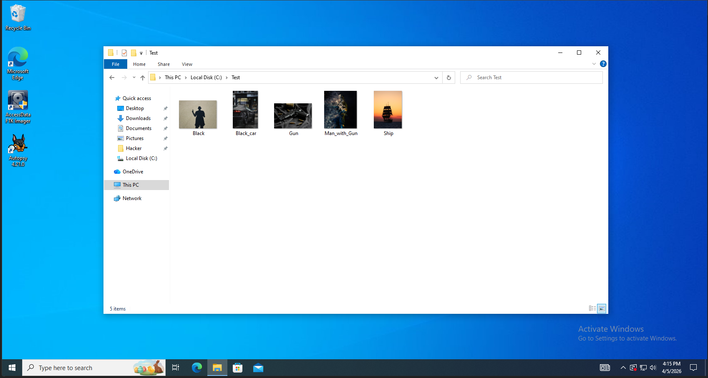
3. Delete the stored files.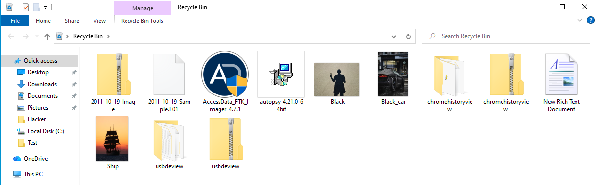
4. Empty the Recycle Bin.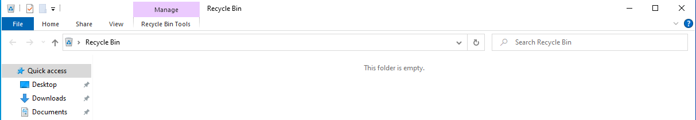

#### Phase 2: Disk Image Conversion (Ubuntu)
1. Identify the VM disk (Windows 10 x64.vmdk) - `ls "/path/to/vm/Windows 10 x64"` 
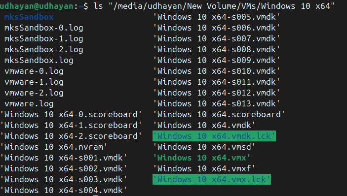
2. Convert VMDK to RAW (.dd) - `qemu-img convert -f vmdk -O raw "Windows 10 x64.vmdk" disk.dd`
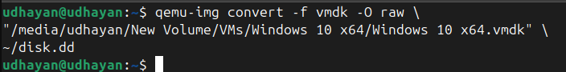
3. Convert RAW to E01 - `ewfacquire disk.dd`
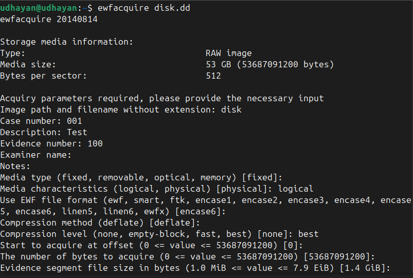
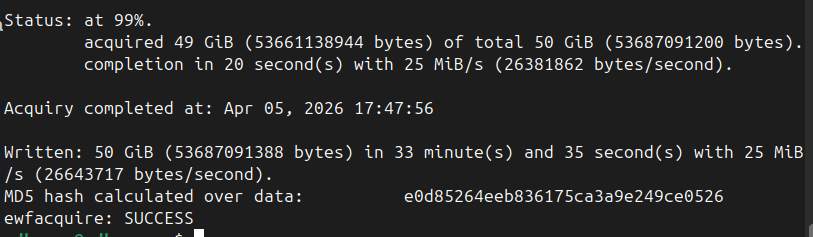
#### Phase 3: Disk Analysis using Autopsy (Windows 10 - VM)
1. Create a new case and enter the case name. 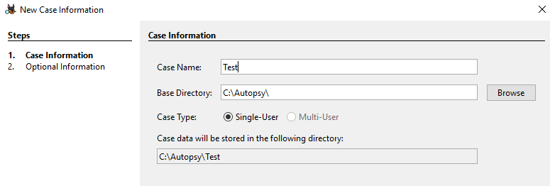
2. Select Disk Image or VM file option. 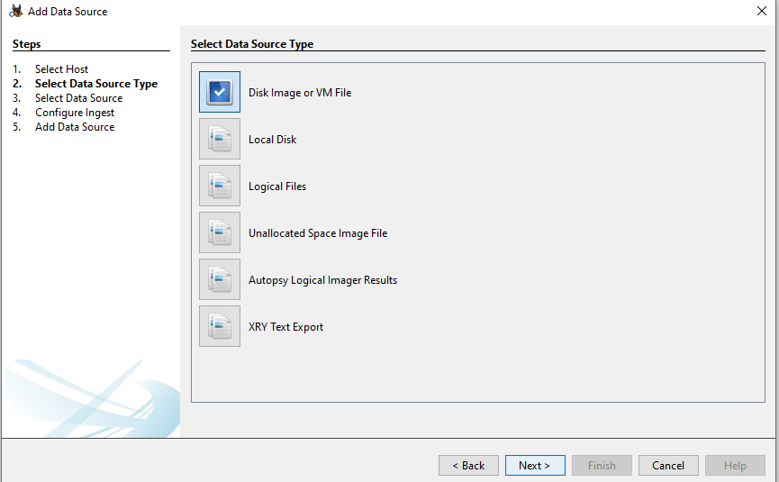
3. Add a data source (path of the image file). 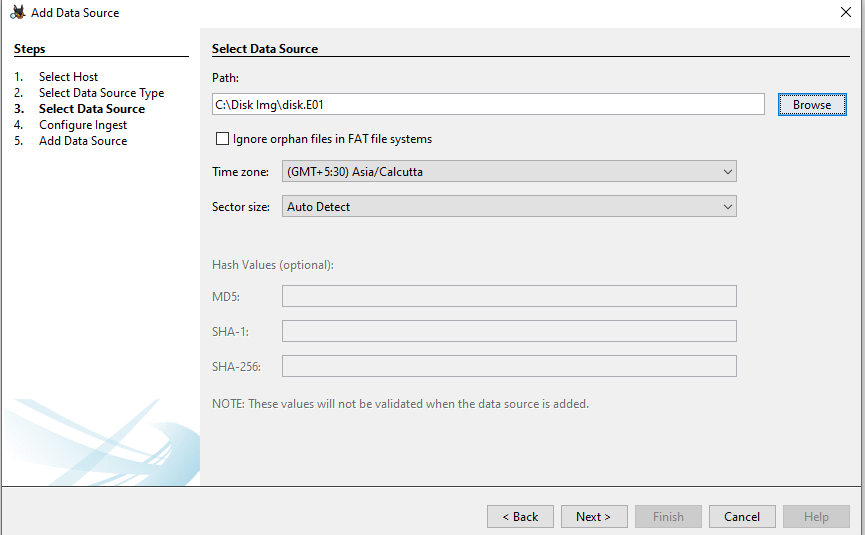
4. Select the analysis modules and proceed. 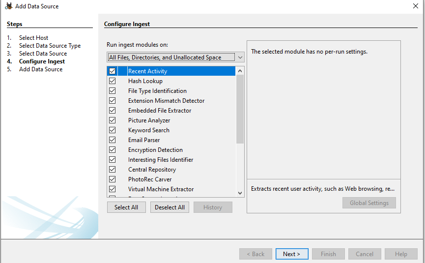
5. Few minutes to take processing and proceed to dashboard and start analysis, recover
files. 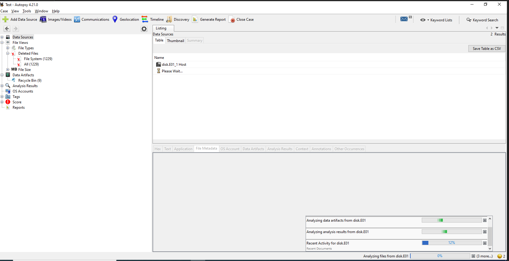
#### Phase 4: File Recovery
1. Navigate to Data Artifacts → Recycle Bin 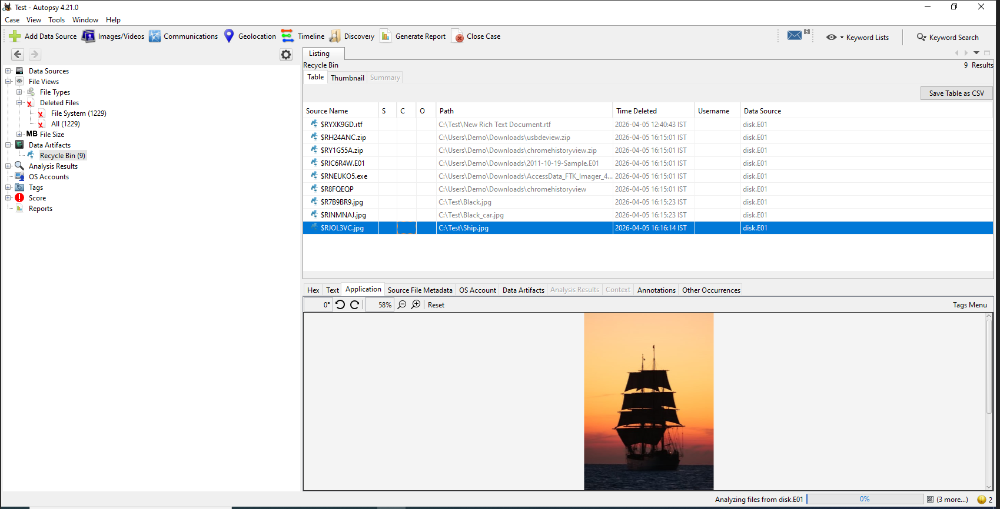
2. To view file metadata: Select any file → Source File Metadata 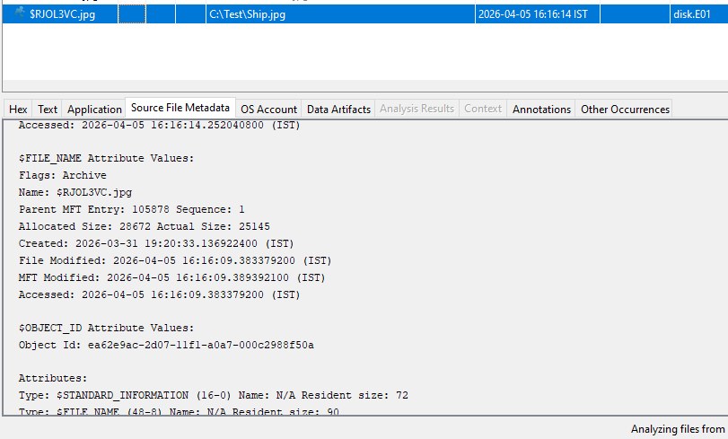
3. To Recover file, Right Click the file → Browse the Path → Enter file name → Save 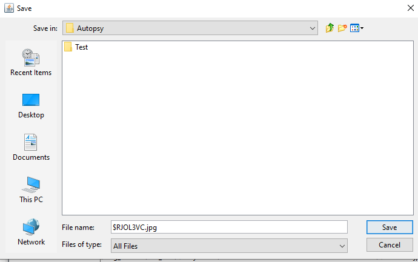
4. Go the Location and file get successfully extracted and saved. 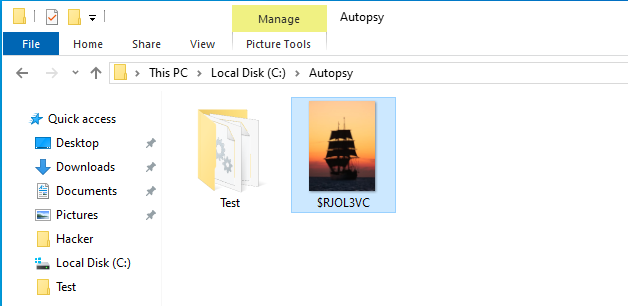

### 🎯 Results
- Successfully converted VM disk (.vmdk) to RAW (.dd) and E01 formats.
- Identified and recovered deleted image files from the forensic disk image.
- Extracted files were viewable and matched expected content, confirming successful
recovery.

### 🏁 Conclusion
This project demonstrates the complete process of disk forensics, including disk acquisition, conversion, and analysis. Deleted files were successfully recovered using Autopsy.

> Note: Deleted data is not immediately erased but remains recoverable until overwritten.